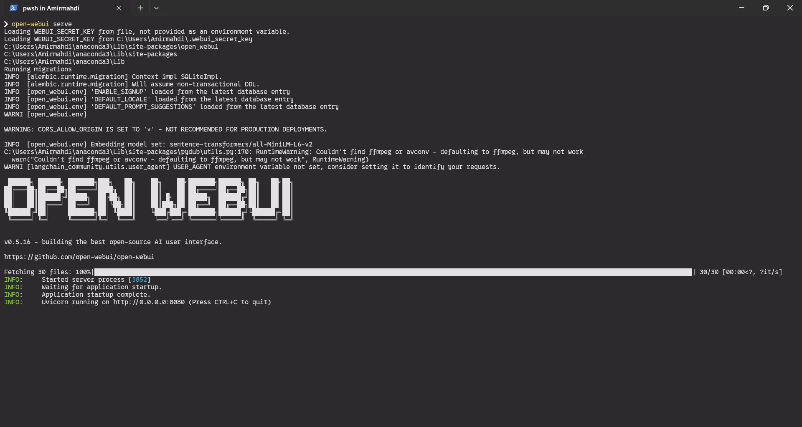
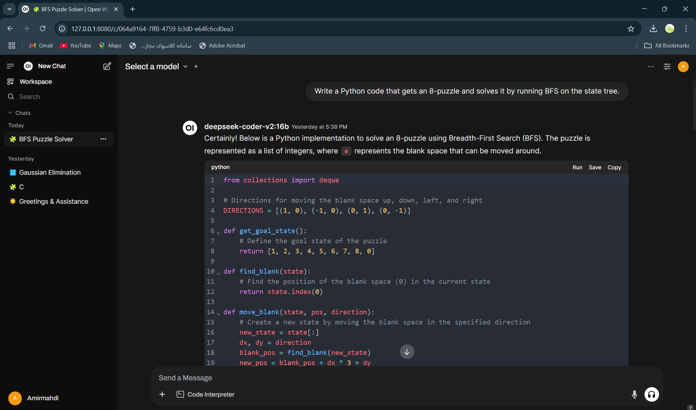

# 🚀 Running DeepSeek Locally with Ollama & Open-WebUI

DeepSeek is a powerful AI coding assistant that you can run locally on your machine. Follow this guide to install and set it up for both terminal and web-based usage.

---

## 🛠 Prerequisites

- **Operating System**: Windows, macOS, or Linux
- **Hardware**: A system with a capable CPU/GPU for optimal performance
- **Internet Connection**: Required for downloading dependencies

---

## 📥 Step 1: Install Ollama

Ollama is a lightweight framework for running AI models locally. Download and install it from the official website:

🔗 **[Download Ollama](https://ollama.com/download)**

Follow the installation instructions based on your OS.

---

## 📌 Step 2: Download DeepSeek Model

Once Ollama is installed, open a terminal and run the following command to download the **DeepSeek Coder V2 (16B)** model:

```sh
ollama pull deepseek-coder-v2:16b
```

This will fetch the required model files. The process might take some time depending on your internet speed.

---

## 🖥 Step 3: Run DeepSeek in the Terminal

After downloading, you can start using DeepSeek directly from the terminal:

```sh
ollama run deepseek-coder-v2:16b
```

Type your queries and enjoy AI-powered coding assistance!
 
---

## 🌐 Step 4: Enable Web UI (Optional but Recommended)

For a more user-friendly experience, you can use **Open-WebUI**, which provides a modern interface for interacting with DeepSeek.

### Install Open-WebUI

Ensure you have Python and `pip` installed, then run:

```sh
pip install open-webui
```

### Start the Web UI

Launch Open-WebUI with:

```sh
open-webui serve
```

Wait until you see the following message:

```
INFO:     Uvicorn running on http://0.0.0.0:8080 (Press CTRL+C to quit)
```
 

### Access DeepSeek in Your Browser

Now, open **[http://127.0.0.1:8080/](http://127.0.0.1:8080/)** in your web browser to interact with DeepSeek in a beautiful web interface.



---

## 🎯 Additional Notes

- **Performance Optimization**: If you have a powerful GPU, ensure that Ollama is utilizing it for better performance.
- **Offline Usage**: Since DeepSeek runs locally, you can use it without an internet connection once the model is downloaded. This makes it a great choice for secure or air-gapped environments where cloud-based solutions aren't an option.
- **Troubleshooting**:
  - If Open-WebUI doesn't start, try running it with administrator privileges.
  - If you experience high RAM usage, consider using a smaller model variant.

---

## 🎉 Enjoy Your AI Coding Assistant!

Now you're all set to use DeepSeek locally, either in the terminal or via a modern web UI. Happy coding! 💻✨

